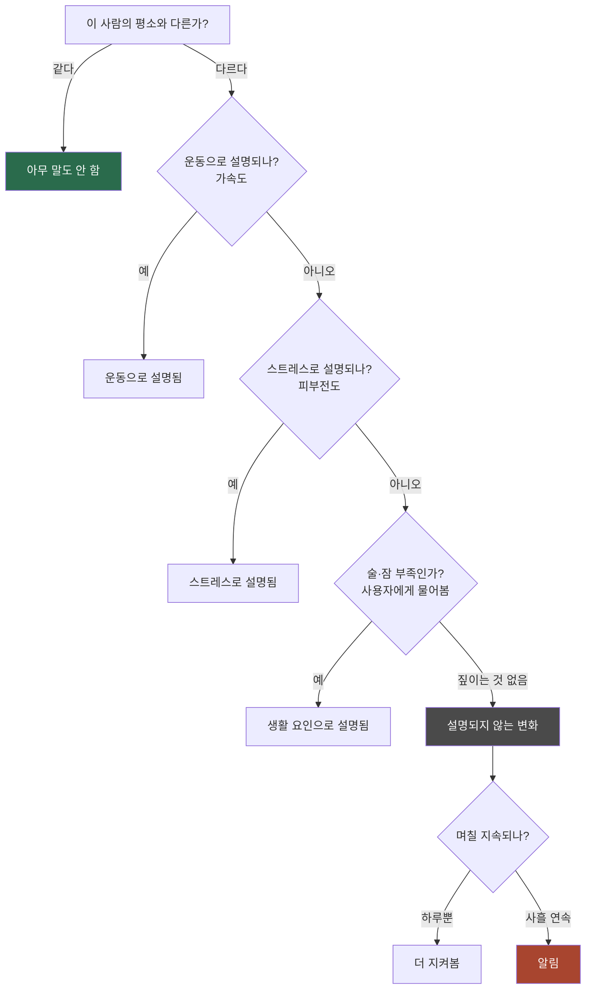
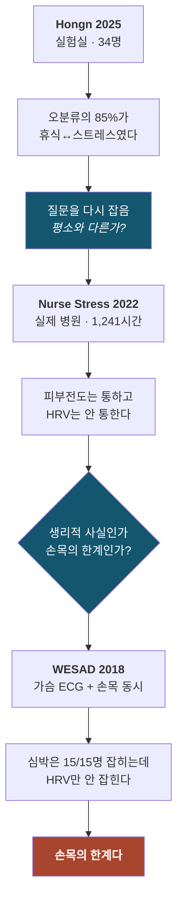
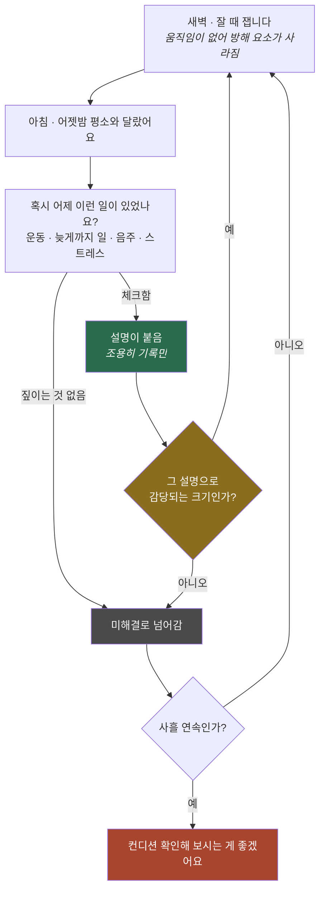

# 설명되지 않는 몸의 변화 찾기

스마트워치가 "오늘 컨디션이 안 좋다"고 알려줍니다.
그런데 **어제 술을 마셔서 그런 건데요.**

기기는 그걸 모릅니다. 그냥 매일 빨간불을 켭니다.
그러다 **진짜 몸이 아플 때도 무시하게 됩니다.**

이 프로젝트는 그 문제를 다룹니다.

---

## 왜 어려운가

감염이든 스트레스든, 몸에서 나타나는 반응은 결국 하나로 모입니다.
심박이 오르고, 땀이 나고, 체온이 변합니다.

**손목에서 재는 신호로는 원리적으로 구별이 안 됩니다.**

### 진짜 문제는 알림 횟수가 아닙니다

선행연구(Mishra 2020)는 건강한 사람에게 한 달에 0.66번 헛경보가 났다고 보고했습니다.
한 달에 한 번이면 참을 만합니다. **그래서 이게 문제가 아니라고 생각하기 쉽습니다.**

문제는 다른 데 있습니다. **몸이 평소와 달라지는 날 자체가 훨씬 흔합니다.**

| 심박이 평소보다 오르는 날 | 얼마나 자주 |
| --- | --- |
| 운동, 음주, 늦게 잔 날, 일이 몰린 날 | 주 3–4회 → **월 15회 안팎** |
| 실제로 감염되는 것 | 성인 연 2–3회 → **월 0.2회** |

**"평소와 다른 날" 중 진짜 아픈 날은 100번에 한두 번입니다.**
나머지는 전부 이유가 있는 날입니다.

여기서 갈림길이 생깁니다.

- **문턱을 높이면** — 알림은 조용해지지만 초기 신호를 놓칩니다.
  0.66번이 작아 보이는 건 이쪽으로 맞췄기 때문입니다.
  그런데 초기에 잡는 게 이 기술의 존재 이유입니다.
- **문턱을 낮추면** — 15회 쪽에서 헛경보가 쏟아집니다.

> 문턱을 어디에 두든 손해입니다.
> **문턱 조정으로는 못 풉니다. 그 15회를 설명해서 걷어내야 풉니다.**

## 그래서 질문을 바꿨습니다

감염을 **찾으려** 하지 말고, **설명되는 것을 걸러내자.**



**분류기는 "모른다"고 말할 수 없습니다.** 배운 것 중에 반드시 하나를 골라야 하니까요.
그런데 진짜 몸에 이상이 생기면 그건 우리가 가르쳐준 적 없는 상황입니다.
**모른다고 답하는 게 정답인 상황**입니다.

---

## 무엇을 확인했나

공개 데이터 **세 개**로 직접 돌려봤습니다.
각 데이터가 앞 데이터에서 생긴 질문에 답하는 구조입니다.



| 데이터 | 무엇 | 규모 |
| --- | --- | --- |
| **Hongn 2025** | 실험실, 자전거 운동과 암산 과제 | 34명 / 1,251 구간 |
| **Nurse Stress 2022** | 실제 병원에서 근무하는 간호사 | 15명 / **1,241시간** |
| **WESAD 2018** | 가슴 ECG와 손목을 **동시에** 측정 | 15명 / 877 구간 |

### 1. 논문 수치를 그대로 믿으면 안 됩니다

원 논문이 93% 나왔다고 하는데, **같은 사람 데이터가 학습과 평가에 같이 들어가 있었습니다.**
사람 단위로 제대로 나누니 성적이 **0.09 떨어집니다.**

### 2. 우리가 원래 잡은 질문이 틀렸습니다

"운동을 스트레스로 착각하는 걸 줄이자"였는데, 실제로 틀린 걸 세어보니
**85%가 휴식↔스트레스**였습니다. 운동은 가속도만 넣으면 그냥 갈립니다.

**진짜 어려운 건 가만히 있을 때 편안한지 긴장했는지 구별하는 것**이고,
그건 "이 사람 평소랑 다른가"와 같은 질문입니다.

### 3. 개인차가 반응보다 큽니다

| | |
| --- | --- |
| 사람마다 평소 심박 | 53–101 bpm |
| 한 사람이 스트레스 받으면 | **+7.7 bpm** (34명 중 30명) |

반응은 분명히 있는데 **그게 사람 사이 차이보다 작습니다.**
피부전도는 41배 차이입니다. 누구인지 모르면 판단이 불가능합니다.

### 4. 실험실에서 만든 규칙은 절반만 통합니다

실제 병원 근무 1,241시간에 그대로 적용해봤습니다.

| | 실환경에서 |
| --- | --- |
| 피부전도 · 땀 반응 | ✅ 통함 |
| 심박 | △ 약함 |
| **심박변이도 (HRV)** | ❌ **전혀 안 통함** |

### 5. HRV는 손목으로 못 재는 것이었습니다

WESAD로 **같은 사람, 같은 시각**에 가슴 ECG와 손목을 동시에 봤습니다.

| | 가슴 ECG | 손목 |
| --- | --- | --- |
| HRV | 27% 감소 (10/15명) | **방향 반대** |
| **심박수** | +21 bpm (**15/15명**) | +24 bpm (**15/15명**) |

**심박수는 손목으로도 완벽하게 잡힙니다.**
신호가 나쁜 게 아니라 **HRV라는 지표가 손목에서 못 쓰이는 것**입니다.

> HRV는 스트레스에 반응합니다. **다만 손목으로는 잴 수 없습니다.**

### 6. 모르는 것을 모른다고 합니다

운동 규칙을 **통째로 지우고** 운동하는 사람 데이터를 넣었습니다.
비교 대상도 공정하게 **운동을 한 번도 배우지 않은** 분류기로 맞췄습니다.

| | 운동 중인 사람을 보고 |
| --- | --- |
| 분류기 | **96%를 "스트레스"라고 단정** |
| 우리 구조 | **95%를 "설명 안 됨"** |

**이게 규칙을 두는 이유 전체입니다.**

---

## 서비스는 이렇게 생겼습니다

문제 정의로 되돌아갑니다 — **"사용자 입력이 없는 기기는 구별할 수 없다."**
그러면 입력을 받으면 됩니다.



**이 화면이 제품이자 동시에 데이터 수집기입니다.**

### ⚠ 설명이 붙어도 끝이 아닙니다

**운동한 날에도 아플 수 있습니다.** "어제 운동했다"에 체크했다고 창을 닫아버리면
**사용자의 자기보고가 곧 무죄 증명이 되어버립니다.** 그러면 설명이 가장 잘 붙는
사람 — 매일 운동하고 자주 늦게 자는 사람 — 이 가장 늦게 발견됩니다.

그래서 두 가지를 둡니다.

1. **설명이 붙은 날도 지우지 않고 기록에 남깁니다.** "그럴 만하다"는 조용히
   넘기라는 뜻이지 없던 일로 하라는 뜻이 아닙니다.
2. **그 설명으로 감당되는 크기를 넘으면 설명이 있어도 넘깁니다.**
   같은 사람이 평소 운동한 날 벗어나는 정도를 학습 구간에서 미리 재두고,
   그 상한(95분위)을 넘으면 닫지 않습니다.
   → `deviation.fit_cause_ceiling()` / `EXCEEDS_EXPLANATION`

상한은 **학습 구간에서만** 정합니다. 임계값과 같은 이유입니다
(테스트: `tests/test_deviation.py`).

### 사흘 누적 부분은 만들었지만 아직 검증 안 됐습니다

`src/nesy/persistence.py` 로 구현했고 단위 테스트 12건이 경계 조건을 고정합니다.
Nurse 데이터로 돌려봤는데 **우연 수준을 못 넘었습니다.**

이유는 데이터가 안 맞아서입니다. 이 계층은 **자는 동안** 재는 걸 전제하는데
Nurse는 전부 **근무 중**이고, 사건이 관측일의 39.8%로 전혀 드물지 않습니다.
교란을 없애려고 새벽에 재는 설계를 **교란이 최대인 조건에서 시험한 셈**입니다.

**안 된다고 나온 게 아니라 답이 아직 없는 것**입니다. 그 구별은 흐리지 않습니다.
자세한 내용과 무엇이 더 필요한지는 [`docs/PERSISTENCE.md`](docs/PERSISTENCE.md).

> **진단하지 않습니다.** "감염이 의심됩니다"는 의료기기 영역입니다.
> 우리는 **설명하지 못한 변화가 있다는 사실**만 알립니다.

데모 앱: [`watch/ExcuseGauge/`](watch/ExcuseGauge/) (watchOS, Xcode 필요)

---

## 코드 돌려보기

```bash
pip install -r requirements.txt
python -m pytest tests -q          # 21개 통과하면 환경 정상
```

데이터 없이 파이프라인만 확인하려면:

```bash
python scripts/00_make_synthetic.py
python scripts/02_build_features.py --raw data/raw/SYNTHETIC
python scripts/07_nesy.py
```

가짜 데이터의 성능 수치는 **연구 결과가 아닙니다.** 코드가 도는지만 확인하는 용도입니다.

실제 데이터는 [`docs/EXP1_STRESS_EXERCISE.md`](docs/EXP1_STRESS_EXERCISE.md) 참고.

---

## 문서 어디부터 볼까

| 처음이라면 | |
| --- | --- |
| [`docs/NARRATIVE.md`](docs/NARRATIVE.md) | **전체 이야기.** 문제 → 접근 → 검증 → 서비스 |
| [`docs/HRV_VERDICT.md`](docs/HRV_VERDICT.md) | 가장 견고한 발견 하나만 본다면 |

| 코드를 만진다면 | |
| --- | --- |
| [`docs/SCHEMAS.md`](docs/SCHEMAS.md) | 파일 주고받는 규칙. **먼저 읽을 것** |
| [`docs/EXP1_STRESS_EXERCISE.md`](docs/EXP1_STRESS_EXERCISE.md) | 실행 순서, 역할 분담 |

| 결과를 확인한다면 | |
| --- | --- |
| [`docs/RESULTS_20260905.md`](docs/RESULTS_20260905.md) | 실험실 데이터 전체 결과 |
| [`docs/NURSE_TRANSFER.md`](docs/NURSE_TRANSFER.md) | 실환경 이식 검증 |
| [`docs/DEVIATION_REDESIGN.md`](docs/DEVIATION_REDESIGN.md) | 이탈 점수 설계 |
| [`docs/PERSISTENCE.md`](docs/PERSISTENCE.md) | 알림 누적 계층 (**검증 미완**) |

| 다음 단계라면 | |
| --- | --- |
| [`docs/RESEARCH_REVIEW.md`](docs/RESEARCH_REVIEW.md) | 심사에서 나올 질문과 대응 |
| [`docs/LITERATURE_VERIFICATION.md`](docs/LITERATURE_VERIFICATION.md) | 인용 검증 (**Li 2026은 보류**) |
| [`docs/EXPERIMENT_PROTOCOL.md`](docs/EXPERIMENT_PROTOCOL.md) | 자체 측정 절차 |

---

## 이 폴더에 뭐가 있나

```
src/nesy/          분석 코드
  io_e4            Empatica E4 파일 읽기
  preprocess_*     맥박·피부전도·움직임 전처리
  deviation        개인 평소 대비 얼마나 벗어났나
  facts / rules    생리 상태 판정과 규칙
  nesy_audit       "이 판단을 믿을 근거가 있나"
  wesad / nurse    데이터셋별 로더

scripts/           00부터 순서대로 실행
watch/ExcuseGauge/ watchOS 데모 앱
docs/              문서
```

## 먼저 밟은 함정들

같은 실수를 반복하지 않도록 적어둡니다. 전부 실제로 겪은 것입니다.

- **개인 기준을 여러 날 합쳐서 만들면 안 됩니다.** 밴드를 다시 차면 기준선이
  통째로 튑니다 (심박 19 bpm, 피부전도 15배). 같은 착용 구간 안에서만 비교합니다.
- **움직임은 개인 z-score로 판정하면 안 됩니다.** 물리량이므로 절대 기준을 씁니다.
- **임계값을 전체 데이터 보고 정하면 안 됩니다.** 학습 구간 안에서만 정합니다.
- **파일 형식이 문서와 다릅니다.** Hongn은 날짜 문자열, Nurse는 epoch 숫자입니다.
- **시각을 반드시 맞춰야 합니다.** Nurse에서 시간대를 안 맞춰 라벨 21%를 잃었습니다.
- **한 사람이 두 폴더로 쪼개져 있을 수 있습니다** (`S11_a`, `S11_b`).
- **정밀도를 우연 수준과 나란히 놓지 않으면 안 됩니다.** 사건이 흔한 데이터에서는
  아무 날에나 울려도 정밀도가 높게 나옵니다. 실제로 "정밀도 1.0"이 나왔는데
  섞어서 재보니 우연이 0.58이었습니다.

---

데이터 출처 · Hongn 2025 (PhysioNet) · Nurse Stress 2022 (Dryad, CC-BY) ·
WESAD 2018 (UCI, 비영리 연구용)
