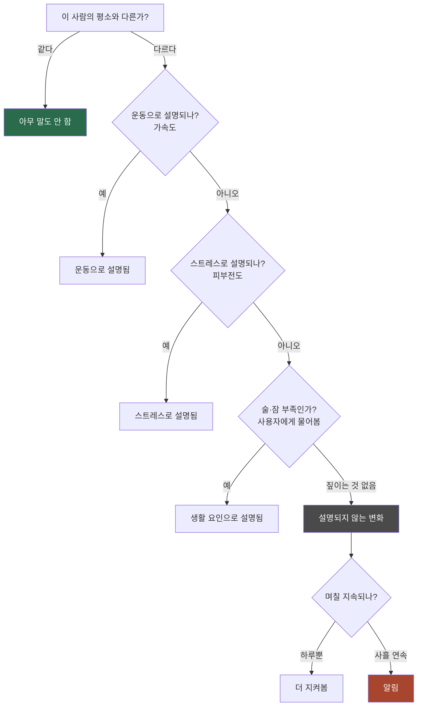
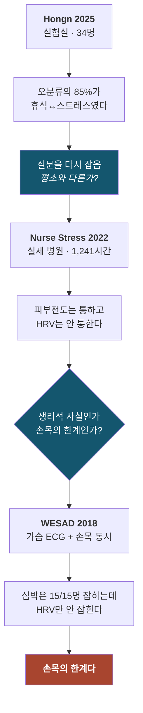
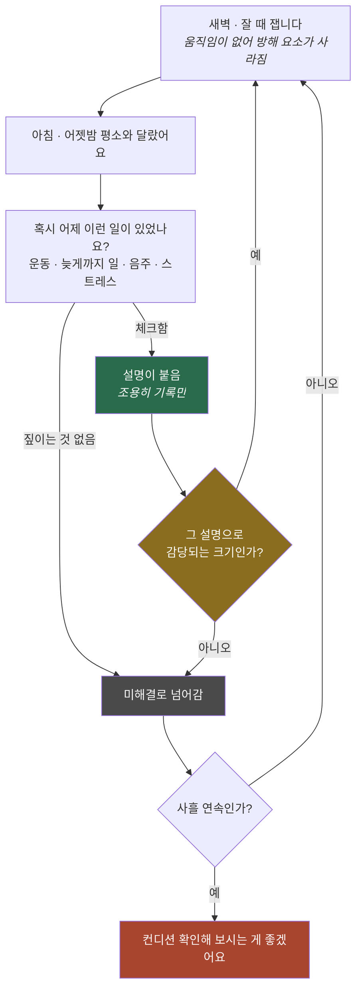

# 설명되지 않는 몸의 변화 찾기

스마트워치가 "오늘 컨디션이 안 좋다"고 알려줍니다.
그런데 **어제 술을 마셔서 그런 건데요.**

기기는 그걸 모릅니다. 그냥 매일 빨간불을 켭니다.
그러다 **진짜 몸이 아플 때도 무시하게 됩니다.**

이 프로젝트는 그 문제를 다룹니다.

---

## 왜 어려운가

감염이든 스트레스든, 몸에서 나타나는 반응은 결국 하나로 모입니다.
심박이 오르고, 땀이 나고, 체온이 변합니다.

**손목에서 재는 신호로는 원리적으로 구별이 안 됩니다.**

### 진짜 문제는 알림 횟수가 아닙니다

선행연구(Mishra 2020)는 건강한 사람에게 한 달에 0.66번 헛경보가 났다고 보고했습니다.
한 달에 한 번이면 참을 만합니다. **그래서 이게 문제가 아니라고 생각하기 쉽습니다.**

문제는 다른 데 있습니다. **몸이 평소와 달라지는 날 자체가 훨씬 흔합니다.**

| 심박이 평소보다 오르는 날 | 얼마나 자주 |
| --- | --- |
| 운동, 음주, 늦게 잔 날, 일이 몰린 날 | 주 3–4회 → **월 15회 안팎** |
| 실제로 감염되는 것 | 성인 연 2–3회 → **월 0.2회** |

**"평소와 다른 날" 중 진짜 아픈 날은 100번에 한두 번입니다.**
나머지는 전부 이유가 있는 날입니다.

여기서 갈림길이 생깁니다.

- **문턱을 높이면** — 알림은 조용해지지만 초기 신호를 놓칩니다.
  0.66번이 작아 보이는 건 이쪽으로 맞췄기 때문입니다.
  그런데 초기에 잡는 게 이 기술의 존재 이유입니다.
- **문턱을 낮추면** — 15회 쪽에서 헛경보가 쏟아집니다.

> 문턱을 어디에 두든 손해입니다.
> **문턱 조정으로는 못 풉니다. 그 15회를 설명해서 걷어내야 풉니다.**

## 그래서 질문을 바꿨습니다

감염을 **찾으려** 하지 말고, **설명되는 것을 걸러내자.**


```mermaid
flowchart TD
    A["이 사람의 평소와 다른가?"] -->|같다| Z["아무 말도 안 함"]
    A -->|다르다| B{"운동으로 설명되나?<br/>가속도"}
    B -->|"예"| E1["운동으로 설명됨"]
    B -->|"아니오"| C{"스트레스로 설명되나?<br/>피부전도"}
    C -->|"예"| E2["스트레스로 설명됨"]
    C -->|"아니오"| D{"술·잠 부족인가?<br/>사용자에게 물어봄"}
    D -->|"예"| E3["생활 요인으로 설명됨"]
    D -->|"짚이는 것 없음"| U["설명되지 않는 변화"]
    U --> P{"며칠 지속되나?"}
    P -->|"하루뿐"| W["더 지켜봄"]
    P -->|"사흘 연속"| N["알림"]

    style U fill:#4a4a4a,color:#fff
    style N fill:#a8452f,color:#fff
    style Z fill:#2a6b4c,color:#fff
```

**분류기는 "모른다"고 말할 수 없습니다.** 배운 것 중에 반드시 하나를 골라야 하니까요.
그런데 진짜 몸에 이상이 생기면 그건 우리가 가르쳐준 적 없는 상황입니다.
**모른다고 답하는 게 정답인 상황**입니다.

---

## 무엇을 확인했나

공개 데이터 **세 개**로 직접 돌려봤습니다.
각 데이터가 앞 데이터에서 생긴 질문에 답하는 구조입니다.


```mermaid
flowchart TD
    H["<b>Hongn 2025</b><br/>실험실 · 34명"] --> H1["오분류의 85%가<br/>휴식↔스트레스였다"]
    H1 --> H2["질문을 다시 잡음<br/><i>평소와 다른가?</i>"]
    H2 --> N["<b>Nurse Stress 2022</b><br/>실제 병원 · 1,241시간"]
    N --> N1["피부전도는 통하고<br/>HRV는 안 통한다"]
    N1 --> N2{"생리적 사실인가<br/>손목의 한계인가?"}
    N2 --> W["<b>WESAD 2018</b><br/>가슴 ECG + 손목 동시"]
    W --> W1["심박은 15/15명 잡히는데<br/>HRV만 안 잡힌다"]
    W1 --> W2["<b>손목의 한계다</b>"]

    style H2 fill:#14566e,color:#fff
    style N2 fill:#14566e,color:#fff
    style W2 fill:#a8452f,color:#fff
```

| 데이터 | 무엇 | 규모 |
| --- | --- | --- |
| **Hongn 2025** | 실험실, 자전거 운동과 암산 과제 | 34명 / 1,251 구간 |
| **Nurse Stress 2022** | 실제 병원에서 근무하는 간호사 | 15명 / **1,241시간** |
| **WESAD 2018** | 가슴 ECG와 손목을 **동시에** 측정 | 15명 / 877 구간 |

### 1. 논문 수치를 그대로 믿으면 안 됩니다

원 논문이 93% 나왔다고 하는데, **같은 사람 데이터가 학습과 평가에 같이 들어가 있었습니다.**
사람 단위로 제대로 나누니 성적이 **0.09 떨어집니다.**

### 2. 우리가 원래 잡은 질문이 틀렸습니다

"운동을 스트레스로 착각하는 걸 줄이자"였는데, 실제로 틀린 걸 세어보니
**85%가 휴식↔스트레스**였습니다. 운동은 가속도만 넣으면 그냥 갈립니다.

**진짜 어려운 건 가만히 있을 때 편안한지 긴장했는지 구별하는 것**이고,
그건 "이 사람 평소랑 다른가"와 같은 질문입니다.

### 3. 개인차가 반응보다 큽니다

| | |
| --- | --- |
| 사람마다 평소 심박 | 53–101 bpm |
| 한 사람이 스트레스 받으면 | **+7.7 bpm** (34명 중 30명) |

반응은 분명히 있는데 **그게 사람 사이 차이보다 작습니다.**
피부전도는 41배 차이입니다. 누구인지 모르면 판단이 불가능합니다.

### 4. 실험실에서 만든 규칙은 절반만 통합니다

실제 병원 근무 1,241시간에 그대로 적용해봤습니다.

| | 실환경에서 |
| --- | --- |
| 피부전도 · 땀 반응 | ✅ 통함 |
| 심박 | △ 약함 |
| **심박변이도 (HRV)** | ❌ **전혀 안 통함** |

### 5. HRV는 손목으로 못 재는 것이었습니다

WESAD로 **같은 사람, 같은 시각**에 가슴 ECG와 손목을 동시에 봤습니다.

| | 가슴 ECG | 손목 |
| --- | --- | --- |
| HRV | 27% 감소 (10/15명) | **방향 반대** |
| **심박수** | +21 bpm (**15/15명**) | +24 bpm (**15/15명**) |

**심박수는 손목으로도 완벽하게 잡힙니다.**
신호가 나쁜 게 아니라 **HRV라는 지표가 손목에서 못 쓰이는 것**입니다.

> HRV는 스트레스에 반응합니다. **다만 손목으로는 잴 수 없습니다.**

### 6. 모르는 것을 모른다고 합니다

운동 규칙을 **통째로 지우고** 운동하는 사람 데이터를 넣었습니다.
비교 대상도 공정하게 **운동을 한 번도 배우지 않은** 분류기로 맞췄습니다.

| | 운동 중인 사람을 보고 |
| --- | --- |
| 분류기 | **96%를 "스트레스"라고 단정** |
| 우리 구조 | **95%를 "설명 안 됨"** |

**이게 규칙을 두는 이유 전체입니다.**

---

## 숫자로 보는 결과

위 여섯 가지를 **실제로 돌려서 나온 수치**입니다.
`outputs/` 는 스크립트가 다시 만드는 산출물이라 저장소에 올리지 않습니다.
그래서 숫자는 여기에 남겨둡니다. 괄호 안이 원본 파일입니다.

### 표본

| 데이터 | 피험자 | 윈도 | 확보 과정 |
| --- | --- | --- | --- |
| **Hongn 2025** | **34** (36명 중 f07·f13 착용 불량 제외) | **1,251** | 100개 세션 중 92개 통과 · 휴식 566 / 스트레스 398 / 운동 287 |
| **Nurse Stress 2022** | **15** | **148,929** | 496 세션 · **1,241시간** · 사건 9,589(6.4%) / 평온 2,244(1.5%) / 라벨 없음 137,096(92.1%) |
| **WESAD 2018** | **15** | **877** | 가슴 ECG 700 Hz 와 손목 PPG 64 Hz 를 **동시에** 기록 |

윈도는 셋 다 60초 길이 · 30초 이동입니다.
Nurse 의 라벨 없는 92% 는 개인 기준선 계산에만 쓰고 평가에서는 뺐습니다.
**라벨이 없다는 건 스트레스가 없었다는 뜻이 아니기 때문입니다.**

### 1. 사람을 나누면 성적이 떨어집니다

XGBoost · 같은 특징 · 분할 방식만 바꿨습니다 (`tables/baseline_summary.csv`, `tables/split_comparison.csv`).

| 과제 | 무작위 분할 | 피험자 분리 | 차이 |
| --- | --- | --- | --- |
| 휴식 / 스트레스 | 0.896 | 0.761 | **−0.136** |
| 유산소 / 스프린트 | 0.980 | 0.980 | −0.000 |
| 3분류 | 0.923 | 0.809 | **−0.113** |
| 4분류 | 0.916 | 0.819 | **−0.097** |

Macro F1 기준, 네 과제 평균 **−0.09** 입니다.
**떨어지지 않은 건 유산소/스프린트 하나뿐**입니다. 움직임의 세기는 사람이 달라도
그대로 읽히기 때문입니다. 반대로 **사람 안쪽 상태를 묻는 과제일수록 많이 떨어집니다.**

LOSO(한 명씩 빼기)는 0.832 로 group k-fold(0.809)와 같은 수준입니다.
**분할을 어떻게 하든 무작위 분할만 유독 높습니다.** 누수가 맞습니다.

### 2. 틀리는 곳은 한 군데입니다

3분류 · 피험자 분리에서 나온 오답 **253개**를 전부 세었습니다 (`tables/errors_baseline.csv`).

| 어디서 틀렸나 | 건수 | 비중 |
| --- | --- | --- |
| **휴식 ↔ 스트레스** | 107 + 107 = **214** | **84.6%** |
| 스트레스 ↔ 운동 | 18 + 6 = 24 | 9.5% |
| 휴식 ↔ 운동 | 11 + 4 = 15 | 5.9% |

우리가 원래 잡았던 "운동을 스트레스로 착각하는 문제"는 **전체의 9.5%** 였습니다.

### 3. 움직임을 넣으면 운동 혼동은 사라집니다

3분류 · 피험자 분리 · 특징만 늘렸습니다 (`tables/ablation.csv`).

| 특징 | 개수 | Macro F1 | 스트레스→운동 | 운동→스트레스 |
| --- | --- | --- | --- | --- |
| HR | 4 | 0.562 | 0.141 | 0.275 |
| HR+HRV | 24 | 0.704 | 0.098 | 0.139 |
| HR+HRV+EDA | 38 | 0.734 | 0.121 | 0.150 |
| **HR+HRV+EDA+ACC** | 51 | **0.809** | **0.045** | **0.021** |

가속도를 넣는 순간 운동 혼동이 **0.15 → 0.02** 로 내려갑니다.
34명 피험자별로 짝지어 비교하면 이 향상은 **p = 0.0023** (중앙값 +0.047, 34명 중 23명 향상,
Wilcoxon, `tables/significance.csv`) 입니다.

> 그런데 **이건 나쁜 소식입니다.** 남은 84.6% 는 가속도로 안 갈리니까요.
> 그래서 질문을 "이 사람 평소와 다른가"로 옮겼습니다.

### 4. 개인 기준선 이탈 — 무엇을 기준선으로 잡느냐가 전부입니다

같은 이탈 점수, 기준선만 바꿨습니다 (`tables/deviation_baselines.csv`).

| 기준선 | 통합 AUC | 피험자 평균 AUC |
| --- | --- | --- |
| **라벨된 휴식** | **0.770** | **0.789** |
| 저활동 구간 | 0.648 | 0.619 |
| 세션 앞부분(시간 기준) | 0.477 | 0.462 |

시간 기준선은 **0.5 아래**입니다. 세션 시작이 곧 평온은 아니라는 뜻입니다.

채널·집계 조합은 10가지를 돌렸습니다 (`tables/deviation_variants.csv`).

| 조합 | Hongn AUC | Nurse AUC |
| --- | --- | --- |
| EDA+HR · signed | **0.797** | 0.633 |
| 4채널 · signed · 가중 | 0.785 | 0.638 |
| 4채널 · signed | 0.778 | 0.629 |
| **tonic EDA 단독 · signed** | 0.664 | **0.680** |
| 심박계열만 · signed | 0.686 | 0.556 |

**실험실에서 1등인 조합과 실환경에서 1등인 조합이 다릅니다.**
실험실은 EDA+HR, 실환경은 EDA 단독이 가장 낫습니다.
그리고 실환경 최고치가 0.68 로, 실험실 최고치(0.797)에 못 미칩니다.
signed 집계(방향을 살린 합)가 mean·max 보다 항상 낫다는 것만 두 데이터에서 공통입니다.

### 5. 규칙은 성능이 아니라 오류 탐지에 씁니다

같은 신경망 예측에 규칙 감사를 붙였습니다 (`tables/audit_breakdown.csv`, `tables/final_comparison.csv`).

| 감사 판정 | 맞음 | 틀림 | **오류율** |
| --- | --- | --- | --- |
| SUPPORTED (근거가 뒷받침) | 460 | 39 | **7.8%** |
| UNCERTAIN (근거 부족) | 319 | 168 | **34.5%** |
| CONFLICT (근거와 충돌) | 105 | 160 | **60.4%** |

**오류율이 단조 증가합니다.** 감사 판정이 실제 신뢰도와 같은 방향입니다.
CONFLICT + UNCERTAIN 을 "믿지 말라"로 표시하면 **신경망 오류의 89.4%를 잡아냅니다**
(정밀도 0.436). CONFLICT 만 보면 정밀도 0.604 / 재현율 0.436 입니다.

반면 **규칙으로 답을 고치는 건 별로입니다.**

| 방식 | Macro F1 |
| --- | --- |
| 신경망 (HR+HRV+EDA) | 0.712 |
| 신경망 + 규칙 교정 | 0.738 (고친 118건 중 74건 개선 · 31건 악화 · 순 +43) |
| **신경망 + 가속도를 숫자로** | **0.783** |

규칙으로 사후 교정하느니 **가속도를 특징으로 넣는 게 낫습니다**(0.738 < 0.783).
규칙의 값어치는 여기가 아니라 위의 오류 탐지, 그리고 아래 6번입니다.

개별 규칙 발화율과 정밀도는 `tables/rule_coverage.csv` 에 있습니다
(활동량 규칙 R1 정밀도 0.851, R2b 0.884 / 스트레스 규칙 R3 0.786, R3b 0.736 / 휴식 R5 0.773).

### 6. 모른다고 말할 수 있는지 (Exp 1c)

운동 규칙을 통째로 지우고, 비교 대상도 운동을 배운 적 없는 분류기로 맞췄습니다.
운동 구간 287개 중 이탈로 잡힌 **80개**에 대해 (`docs/DEVIATION_RESULTS.md`):

| | 결과 |
| --- | --- |
| 분류기 | **96.2%** 를 "스트레스"로 단정 |
| 우리 구조 | **95.0%** 를 "설명 안 됨"으로 보류 |

### 7. 실환경으로 옮기면 — 하나만 살아남습니다

Nurse 1,241시간, 피험자 내 비교 13명 (`tables/nurse_within_subject.csv`).

| | Hongn (실험실) | Nurse (실환경) |
| --- | --- | --- |
| HR | **+7.7 bpm** · 34명 중 **30명** 상승 | −3.3 bpm · 13명 중 6명 · p=0.24 |
| RMSSD | −6.1 ms · p=0.26 | −2.2 ms · p=0.56 |
| tonic EDA | 상승 | p=1.00 |

**기존 대조군(REPORTED_CALM)으로는 유의한 것이 하나도 없습니다**(p = 0.24–1.00).
그런데 이건 **대조군을 잘못 잡은 탓이 큽니다.** 대조군을 바꿔 다시 쟀습니다
(`tables/nurse_control_variants.csv`).

| 대조군 | 유의한 특징 수 (5개 중) |
| --- | --- |
| A. 보고된 평온 (기존) | **0** |
| B. 사건에서 30분 이상 떨어진 무라벨 구간 | 2 |
| **C. 같은 세션 저활동 하위 25%** | **4** |

**대조군을 제대로 잡으면 EDA·SCR 은 실환경에서도 반응합니다.**
"이식 실패"라고 먼저 썼던 결론은 이 표 때문에 정정했습니다.

활동량 임계는 그대로 무너집니다. 실험실 5개 fold 전부에서 동일하게 뽑힌 **0.020 g**
를 실환경에 적용하면 전체 창의 **73.6%** 가 "활동 중"으로 잡힙니다
(`tables/nurse_activity_thresh.csv`). 근무 자체가 계속 움직이는 일이기 때문입니다.

### 8. HRV — 손목의 한계입니다 (가장 견고한 발견)

WESAD 15명, **같은 사람 · 같은 시각**, 두 신호에 **같은 HRV 함수**를 적용했습니다.

| | 가슴 ECG | 손목 PPG |
| --- | --- | --- |
| RMSSD | 48.6 → 32.0 · **−13.0 ms (−27%)** · **10/15명 감소** · p=0.055 | 154.0 → 133.2 · **+5.0 ms (방향 반대)** · 7/15 · p=0.277 |
| **심박수** | **+21.2 bpm · 15/15명** · p=0.0001 | **+24.4 bpm · 15/15명** · p=0.0001 |

심박수는 손목으로도 **전원 일치**로 잡힙니다. 신호 자체가 나쁜 게 아닙니다.

왜 HRV 만 안 되는지도 확인했습니다.

| 지표 | ECG | PPG | 두 신호의 상관 |
| --- | --- | --- | --- |
| 평균 박동 간격 | 0.8 s | 0.7 s | **r = 0.903** |
| SDNN | 59.0 | 103.3 | r = 0.640 |
| **RMSSD** | 38.0 | **138.1 (3.6배)** | **r = 0.529** |

평균은 맞는데 **변이만 3.6배 부풀려집니다.** 맥파 정점이 완만해 검출 시각이
밀리초 단위로 흔들리고, RMSSD 는 *연속한 간격의 차이*를 재므로 그 지터가 그대로 들어옵니다.
실제 변화(−13 ms)보다 지터가 크면 신호가 묻힙니다. 평균은 지터가 상쇄되어 살아남습니다.

> **HRV는 스트레스에 반응합니다. 손목으로 잴 수 없을 뿐입니다.**

### 9. 사흘 누적 — 만들었고, 이 데이터로는 검증 안 됩니다

Nurse 15명 · 관측일 236일 = **7.75 인·월** (`tables/persistence_sweep.csv`).

| K일 연속 | 경보수 | 경보/인·월 | 탐지율 | 경보 정밀도 |
| --- | --- | --- | --- | --- |
| 1 | 26 | 3.353 | 0.223 | 0.500 |
| 2 | 6 | **0.774** | 0.096 | 0.833 |
| 3 | 1 | 0.129 | 0.011 | 1.000 |
| 4 | 0 | 0.000 | 0.000 | — |

**공짜가 없습니다.** 경보를 줄이면 탐지도 같이 줄어듭니다.
"경보를 0.77회까지 줄였다"만 말하면 탐지율 0.096 을 숨기는 것입니다.

그리고 **우연 수준을 못 넘습니다** (`tables/persistence_chance.csv`).
사건일이 관측일의 **39.8%** 라, 사람별 경보 개수를 유지한 채 날짜만 2,000번 섞어 재보니:

| K | 관측 정밀도 | 우연 정밀도 | p |
| --- | --- | --- | --- |
| 1 | 0.500 | 0.612 | 0.942 |
| 2 | 0.833 | 0.635 | 0.266 |
| 3 | 1.000 | 0.576 | 0.576 |

**"정밀도 1.0" 이 우연 0.576 짜리입니다.** 정밀도만 떼어 보고하면 안 되는 이유입니다.

안 된다고 나온 게 아니라 **이 데이터로는 답이 안 나오는 것**입니다.
이 계층은 자는 동안 재는 걸 전제하는데 Nurse 는 전부 근무 중입니다.
자세한 것은 [`docs/PERSISTENCE.md`](docs/PERSISTENCE.md).

### 결과를 다시 만들려면

```bash
python scripts/01_audit.py            # 세션 감사
python scripts/02_build_features.py   # 특징 추출
python scripts/03_baseline_ml.py      # 기본 분류 성능
python scripts/04_stress_vs_exercise.py  # 특징 ablation
python scripts/05_subject_independent.py # 분할 방식 비교
python scripts/06_neural.py           # 신경망
python scripts/07_nesy.py             # 규칙 감사
python scripts/09_deviation.py        # 이탈 점수 · 기준선 비교
python scripts/10_nurse_audit.py      # Nurse 세션 감사
python scripts/11_nurse_features.py   # Nurse 특징 추출
python scripts/12_nurse_deviation.py  # Nurse 이탈 탐지
python scripts/13_nurse_followup.py   # 대조군 재설정 · 활동량 임계
python scripts/14_deviation_redesign.py  # 채널 · 집계 조합 비교
python scripts/15_wesad_hrv.py        # ECG vs PPG HRV 판정
python scripts/16_persistence.py      # 지속성 계층
```

원본 데이터는 각각 PhysioNet · Dryad · UCI 에서 받아 `data/raw/` 에 둡니다
([`docs/EXP1_STRESS_EXERCISE.md`](docs/EXP1_STRESS_EXERCISE.md)).

---

## 서비스는 이렇게 생겼습니다

문제 정의로 되돌아갑니다 — **"사용자 입력이 없는 기기는 구별할 수 없다."**
그러면 입력을 받으면 됩니다.


```mermaid
flowchart TD
    S["새벽 · 잘 때 잽니다<br/><i>움직임이 없어 방해 요소가 사라짐</i>"] --> M["아침 · 어젯밤 평소와 달랐어요"]
    M --> Q["혹시 어제 이런 일이 있었나요?<br/>운동 · 늦게까지 일 · 음주 · 스트레스"]
    Q -->|"체크함"| OK["설명이 붙음<br/><i>조용히 기록만</i>"]
    Q -->|"짚이는 것 없음"| ACC["미해결로 넘어감"]
    OK --> X{"그 설명으로<br/>감당되는 크기인가?"}
    X -->|"예"| S
    X -->|"아니오"| ACC
    ACC --> T{"사흘 연속인가?"}
    T -->|"아니오"| S
    T -->|"예"| AL["컨디션 확인해 보시는 게 좋겠어요"]

    style X fill:#8a6d1f,color:#fff
    style OK fill:#2a6b4c,color:#fff
    style ACC fill:#4a4a4a,color:#fff
    style AL fill:#a8452f,color:#fff
```

**이 화면이 제품이자 동시에 데이터 수집기입니다.**

### ⚠ 설명이 붙어도 끝이 아닙니다

**운동한 날에도 아플 수 있습니다.** "어제 운동했다"에 체크했다고 창을 닫아버리면
**사용자의 자기보고가 곧 무죄 증명이 되어버립니다.** 그러면 설명이 가장 잘 붙는
사람 — 매일 운동하고 자주 늦게 자는 사람 — 이 가장 늦게 발견됩니다.

그래서 두 가지를 둡니다.

1. **설명이 붙은 날도 지우지 않고 기록에 남깁니다.** "그럴 만하다"는 조용히
   넘기라는 뜻이지 없던 일로 하라는 뜻이 아닙니다.
2. **그 설명으로 감당되는 크기를 넘으면 설명이 있어도 넘깁니다.**
   같은 사람이 평소 운동한 날 벗어나는 정도를 학습 구간에서 미리 재두고,
   그 상한(95분위)을 넘으면 닫지 않습니다.
   → `deviation.fit_cause_ceiling()` / `EXCEEDS_EXPLANATION`

상한은 **학습 구간에서만** 정합니다. 임계값과 같은 이유입니다
(테스트: `tests/test_deviation.py`).

### 사흘 누적 부분은 만들었지만 아직 검증 안 됐습니다

`src/nesy/persistence.py` 로 구현했고 단위 테스트 12건이 경계 조건을 고정합니다.
Nurse 데이터로 돌려봤는데 **우연 수준을 못 넘었습니다.**

이유는 데이터가 안 맞아서입니다. 이 계층은 **자는 동안** 재는 걸 전제하는데
Nurse는 전부 **근무 중**이고, 사건이 관측일의 39.8%로 전혀 드물지 않습니다.
교란을 없애려고 새벽에 재는 설계를 **교란이 최대인 조건에서 시험한 셈**입니다.

**안 된다고 나온 게 아니라 답이 아직 없는 것**입니다. 그 구별은 흐리지 않습니다.
자세한 내용과 무엇이 더 필요한지는 [`docs/PERSISTENCE.md`](docs/PERSISTENCE.md).

> **진단하지 않습니다.** "감염이 의심됩니다"는 의료기기 영역입니다.
> 우리는 **설명하지 못한 변화가 있다는 사실**만 알립니다.

**데모**

| | |
| --- | --- |
| [`watch/web/index.html`](watch/web/index.html) | **더블클릭하면 열립니다.** Windows 포함 어디서나 |
| [`watch/ExcuseGauge/`](watch/ExcuseGauge/) | 원본 SwiftUI 앱 (watchOS, Xcode 필요) |

둘은 같은 판정 코드로 돕니다. 웹 사본에는 발표용으로 **판정 과정 패널**이 붙어 있어
칩을 누르면 계산이 어떻게 바뀌는지 옆에서 같이 보입니다.

---

## 코드 돌려보기

```bash
pip install -r requirements.txt
python -m pytest tests -q          # 21개 통과하면 환경 정상
```

데이터 없이 파이프라인만 확인하려면:

```bash
python scripts/00_make_synthetic.py
python scripts/02_build_features.py --raw data/raw/SYNTHETIC
python scripts/07_nesy.py
```

가짜 데이터의 성능 수치는 **연구 결과가 아닙니다.** 코드가 도는지만 확인하는 용도입니다.

실제 데이터는 [`docs/EXP1_STRESS_EXERCISE.md`](docs/EXP1_STRESS_EXERCISE.md) 참고.

---

## 문서 어디부터 볼까

| 처음이라면 | |
| --- | --- |
| [`docs/NARRATIVE.md`](docs/NARRATIVE.md) | **전체 이야기.** 문제 → 접근 → 검증 → 서비스 |
| [`docs/HRV_VERDICT.md`](docs/HRV_VERDICT.md) | 가장 견고한 발견 하나만 본다면 |

| 코드를 만진다면 | |
| --- | --- |
| [`docs/SCHEMAS.md`](docs/SCHEMAS.md) | 파일 주고받는 규칙. **먼저 읽을 것** |
| [`docs/EXP1_STRESS_EXERCISE.md`](docs/EXP1_STRESS_EXERCISE.md) | 실행 순서, 역할 분담 |

| 결과를 확인한다면 | |
| --- | --- |
| [`docs/RESULTS_20260905.md`](docs/RESULTS_20260905.md) | 실험실 데이터 전체 결과 |
| [`docs/NURSE_TRANSFER.md`](docs/NURSE_TRANSFER.md) | 실환경 이식 검증 |
| [`docs/DEVIATION_REDESIGN.md`](docs/DEVIATION_REDESIGN.md) | 이탈 점수 설계 |
| [`docs/PERSISTENCE.md`](docs/PERSISTENCE.md) | 알림 누적 계층 (**검증 미완**) |

| 다음 단계라면 | |
| --- | --- |
| [`docs/PPT_REVIEW.md`](docs/PPT_REVIEW.md) | **발표 자료** — 무엇을 고칠지와 슬라이드 원고 (+ `docs/발표보강안.pptx` 19장) |
| [`docs/RESEARCH_REVIEW.md`](docs/RESEARCH_REVIEW.md) | 심사에서 나올 질문과 대응 |
| [`docs/LITERATURE_VERIFICATION.md`](docs/LITERATURE_VERIFICATION.md) | 인용 검증 (**Li 2026은 보류**) |
| [`docs/EXPERIMENT_PROTOCOL.md`](docs/EXPERIMENT_PROTOCOL.md) | 자체 측정 절차 |

---

## 이 폴더에 뭐가 있나

```
src/nesy/          분석 코드
  io_e4            Empatica E4 파일 읽기
  preprocess_*     맥박·피부전도·움직임 전처리
  deviation        개인 평소 대비 얼마나 벗어났나
  facts / rules    생리 상태 판정과 규칙
  nesy_audit       "이 판단을 믿을 근거가 있나"
  wesad / nurse    데이터셋별 로더

scripts/           00부터 순서대로 실행
watch/ExcuseGauge/ watchOS 데모 앱
docs/              문서
```

## 먼저 밟은 함정들

같은 실수를 반복하지 않도록 적어둡니다. 전부 실제로 겪은 것입니다.

- **개인 기준을 여러 날 합쳐서 만들면 안 됩니다.** 밴드를 다시 차면 기준선이
  통째로 튑니다 (심박 19 bpm, 피부전도 15배). 같은 착용 구간 안에서만 비교합니다.
- **움직임은 개인 z-score로 판정하면 안 됩니다.** 물리량이므로 절대 기준을 씁니다.
- **임계값을 전체 데이터 보고 정하면 안 됩니다.** 학습 구간 안에서만 정합니다.
- **파일 형식이 문서와 다릅니다.** Hongn은 날짜 문자열, Nurse는 epoch 숫자입니다.
- **시각을 반드시 맞춰야 합니다.** Nurse에서 시간대를 안 맞춰 라벨 21%를 잃었습니다.
- **한 사람이 두 폴더로 쪼개져 있을 수 있습니다** (`S11_a`, `S11_b`).
- **정밀도를 우연 수준과 나란히 놓지 않으면 안 됩니다.** 사건이 흔한 데이터에서는
  아무 날에나 울려도 정밀도가 높게 나옵니다. 실제로 "정밀도 1.0"이 나왔는데
  섞어서 재보니 우연이 0.58이었습니다.

---

데이터 출처 · Hongn 2025 (PhysioNet) · Nurse Stress 2022 (Dryad, CC-BY) ·
WESAD 2018 (UCI, 비영리 연구용)
